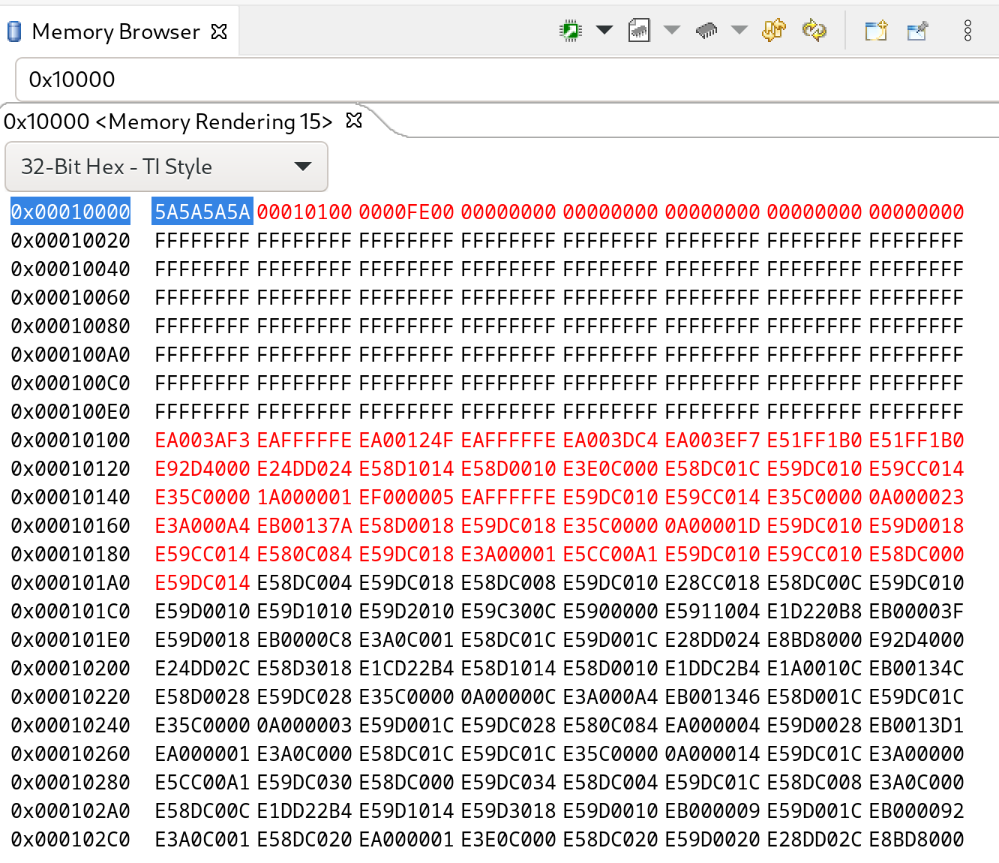
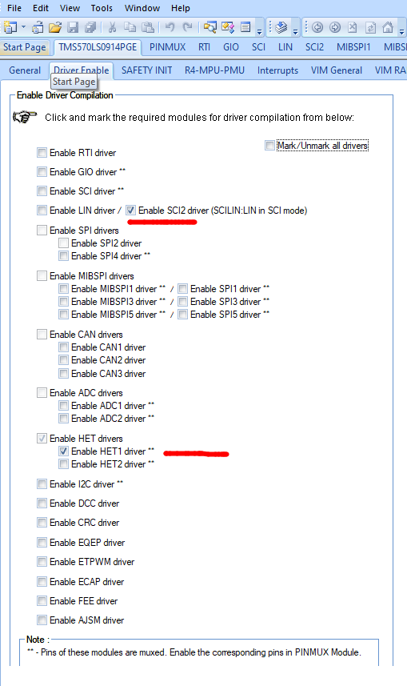
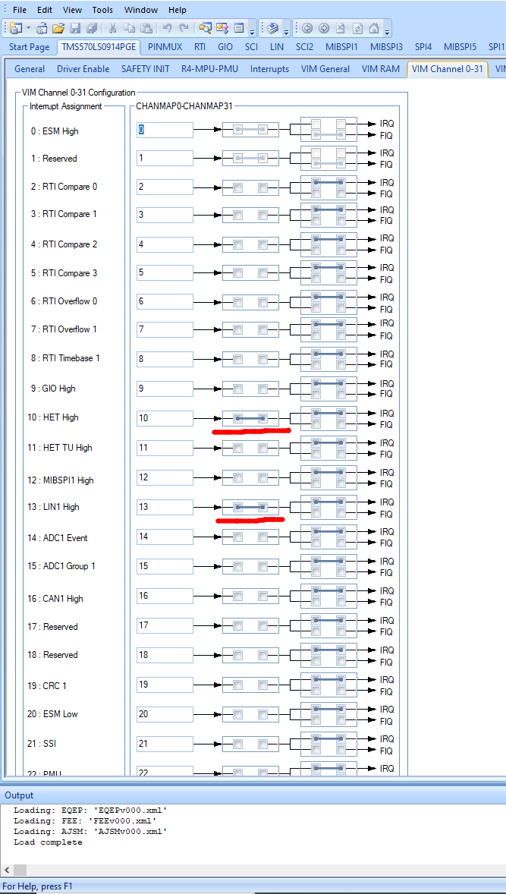
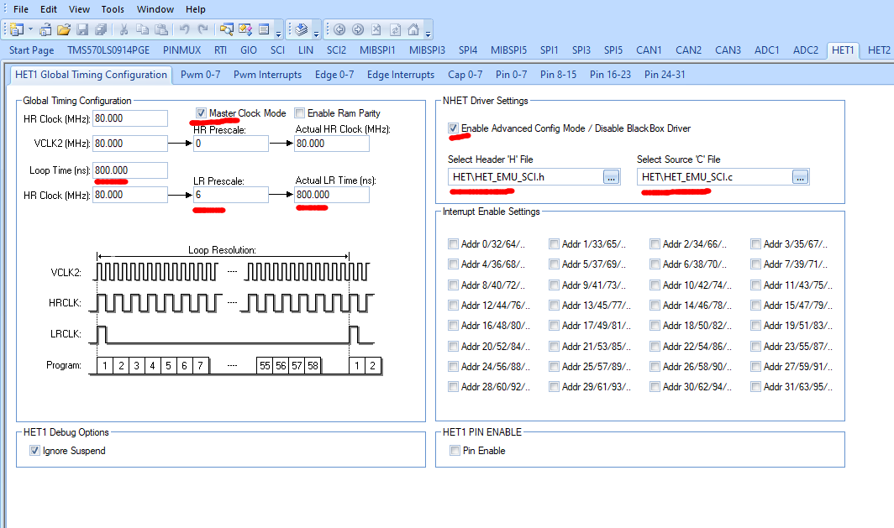
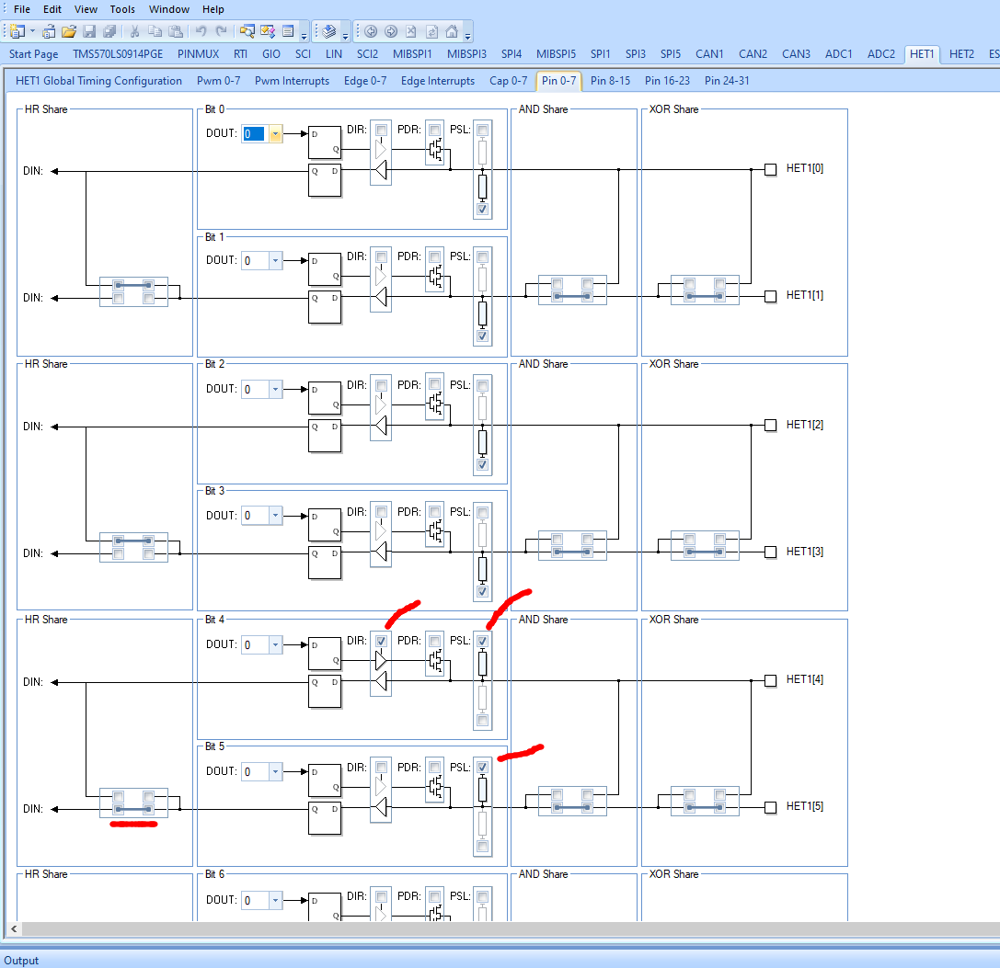
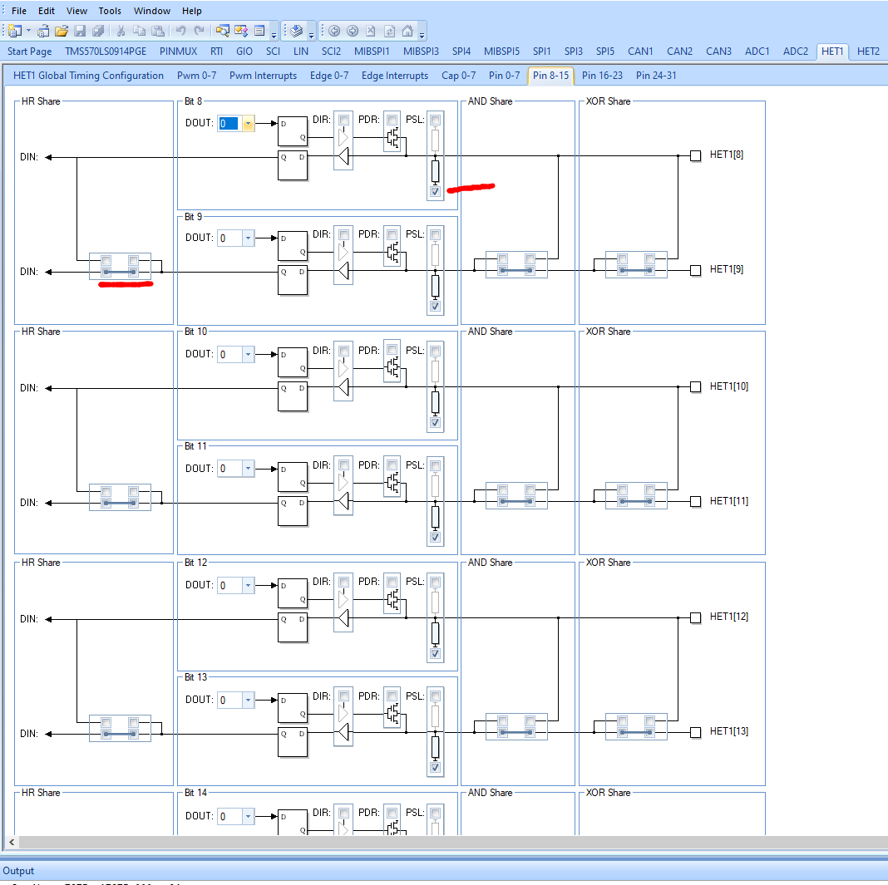

# Flashloader

This code is a **flash loader** for the Texas Instruments TMS570LS0914PGE SoC.
Once this code has been loaded to to system over JTAG,
the N2HET co-processor is used as an UART that prompts the user over a
serial line and uses the YModem protocol to upload and download
software to the SoC.

The code is based on sample code supplied by TI and described
in the boot loader description found [here](docs/spna192.pdf).

In this context a **flash loader** is the code that runs on the micro controller
while a **host loader** is a program on an external computer, communicating with it
to download new code into flash.

Only the serial version is present here, while TI also provides `spi` and `can bus`
versions.

When built and installed with TI's `Code Composer Studio` on a micro controller
it can be used to load a new application into flash memory over a serial port
using a **host loader** that can use the **ymodem protocol** to send and receive
files. One such host loader is the [pyMicroloader](https://github.com/burnsfisher/pyMicroloader)
that has already been updated to work with this flash loader.

It is also possible to interact directly with the flash loader by connecting a
USB-Serial adapter to the `CON_TX` and `CON_RX` pins on the `rt-ihu`. A `prompt pin`
is also used to stop the flash loader from executing a valid program in flash and
prompt the user with a menu instead as described below. The prompt pin on the rt-ihu
is `ATTACHED`.

## Menu

If the the **prompt pin** (HET1 pin 8) is set to high and the MCU is
rebooted, a prompt `$ `, will be presented on the the serial port and the flash
loader will wait for a single character command. By responding with `?` the following
menu will be shown

```text
================== Main Menu ==========================
  1. Download an Application Image To the Internal Flash
  2. Upload the Application Image From the Internal Flash
  3. Execute the Application Code
  4. Get Flash Loader Version
  5. Get Device Information
  6. Application Status
  7. Select Run target
  8. Soft reset
  ?. Show this menu
=======================================================
```

### Download application image

The first choice will have the flash loader enter ymodem receive mode and wait for
a binary image file to be downloaded by the host. Ymodem will start sending a series of
`C` characters asking for CRC mode checksums on the 1k packets coming from the host. The ymodem protocol has been verified to work correctly with both the common
Unix `sz` programs and a Python version used by the host loader.
The flash loader expects a single file to be sent from the host.

### Upload application image

Choice number 2 will attempt to send the application image from the MCU to the host
computer over the serial port using ymodem. Again this has been tested with the same
programs as the download. A script that uses the `rb` program from the Unix `sz` suite
to receive the application can be as simple as:

```sh
#!/usr/bin/env bash

DEV=/dev/ttyUSB0

stty -F $DEV 115200
rb >$DEV <$DEV
```

The MCU will send the program under the name `UploadedApplicationImage.bin` and it
has been used to verify that the whole ymodem transmission works, by comparing
the uploaded code with the binary file that was transmitted, byte for byte.

### Execute the application

If an application has successfully been downloaded, hitting a `3` will start its
execution. The flash loader checks its memory block for the pattern `5A5A5A5A`,
that is written to flash on the conclusion of a successful download operation.
If the pattern is not found, i.e. because no program has been downloaded, nothing
happens when this option is selected.

### Get flash loader information

Option `4` simply prints out the version of the flash loader:

```text
Flash Loader TI: 1.0.0
```

### Get device information

The output from option `5` looks like:

```text
DEV:           8046AD1D
LOT NUM:       00B6E020
WAFER LOC NUM: 0000502B
FLASH START:   00010000
FLASH END:     00140000
```

The flash start address excludes the flash loader itself.

### Application status

Option `6` shows the following information about the application, if loaded:

```text
Application valid pattern: 5A5A5A5A
Application image size:    0000FE00
Application image address: 00010100

Run target value set to: 0x00000000, Unknown
Prompt pin is active
```

Before an application is loaded for the first time (new flash loader) all these
values are `FFFFFFFF`.

The status of the prompt pin can also be seen on this output. The idea is to connect
this GIO input pin to the Vcc pin on the `USB-Serial` adapter from the host computer
and thereby have the flash loader go to prompt mode after the next reboot when
a host is connected regardless of the validity of the stored application.

### Select Run target

This option allows for setting the value of the `run target` in SRAM.
Hitting `7` repeatedly will cycle trough the available run targets.

```text
Run target value set to: 0x55555555, Flash loader
Run target value set to: 0xAAAAAAAA, Application
Run target value set to: 0x00000000, Unknown
```

The run target together with the status of the GPIO-pin connected
to the USB-Serial interface will allow for bypassing the flash loader
on reset as shown below, when a valid application is in flash.

| GPIO	| Target pattern | Jump to |
| ------|----------------|---------|
| Low	  | 0x55555555 | Loader |
| Low	  | 0xaaaaaaaa | Application |
| Low	  | 0x00000000 | Application |
| High  | 0x55555555 | Loader |
| High  | 0xaaaaaaaa | Application |
| High  | 0x00000000 | Loader |

## Memory structure

The flash loader itself lives at the bottom of the flash memory starting with
`0x20` (8x32 bits) for interrupt vectors followed by the boot loader code. The
application area starts at flash address `0x10000` (64k) with 256 bytes (`0x100`) of
book keeping data followed by the application itself in address `0x10100`. A dump
of application memory is shown below:



If an application has been loaded without an error, the flash loader will write
the pattern `0x5A5A5A5A` at the start of the area, followed by the start address
of the application (`0x10100` here), followed by the size of the application in
bytes. The proper application code starts at address `0x10100` with 32 bytes containing
eight interrupt vectors of the application.

After boot the flash loader is entered, as it occupies the low memory of flash.
In case of a valid pattern found in the application start area, the flash loader
jumps to the application start offset, which in turn shifts all interrupts
to the application handlers. The application will therefore handle all interrupts
until the processor is rebooted and the cycle is repeated.

This in turn means that the application must be set to run in that address.
The linker command file for an application running using the flash loader
could have the `MEMORY` section like:

```text
  VECTORS   (X)   : origin=0x00000000 length=0x00000040
  FLASH   (RX)    : origin=0x00000040 length=0x0000FFC0

  RUNTARGET (RW)  : origin=0x08000000 length=0x00000010
  STACKS  (RW)    : origin=0x08000010 length=0x000014F0
  RAM (RW)        : origin=0x08001500 length=0x0001EAE0
  RAMVECTORS(RWX) : origin=0x0801FFE0 length=0x00000020
```

Note that the length of the `FLASH0` has to be shortened by the new offset too.
Also note that this is only done once for a given project and can possibly
be done automatically in the `HalCodeGen` program generator.

`RUNTARGET` is a new small (16 byte) section that holds the run target
value described above.

`RAMVECTORS` is another new section that holds interrupt vectors in RAM,
in order to dispatch correctly between ISR in flash loader and the
application.

## Development environment

This code has been developed using the TI multi-platform, Eclipse
based Code Composer Studio. Parts of the code has been generated
with the Windows only HALCoGen code generator. Still another
part must be assembled by the TI HET environment, again only
available on Windows!

## File Structure

### halcogen

This directory contains code that is generated by the Windows-only
HALCoGen program.  **This code should not be edited directly.**

### loader

This directory contains the proper flash loader code.
Execution starts from `loader_main()` that is called
from the generated `main()` function in `halcogen/source/sys_main.c`

### lib

This directory contains the TI Flash Library used to
actually write the code to flash (from RAM).

## HALCoGen setup

If needed the whole `halcogen` directory can be copied to a Windows machine
to (if Code Composer Studio is not running on a Windows machine). The setup
for this application is described below, assuming all the files have been
copied across and `FlashLoader.hcg` has been opened in the GUI program.

## Enable drivers

For this application only two drivers need to be enabled:



The `SCI2` driver is used if a regular serial port is used, but `HET1` if
the N2HET is used instead.

## Interrupts selection

For this application we need to enable interrupt 10 and 13 and they should
be set as `IRQ`, not `FIQ`. This will in turn cause HALCoGen to generate
empty service routines for these interrupts.



## Configure HET1

Make sure that all the marked fields in the screenshot below are set.
The header and source files have been generated from the `.het` assembler
file and are residing in the `HET` directory on the same level as the
HALCoGen source and include directories. These files are copied by the
tool into its own structure.



## Configure HET1 pins 4 and 5

These pins are used for Tx and Rx in the UART respectively.
Make sure direction of pin 4 is output and it has a pull up active.
For pin 5 also have pull up, but keep it as input (the default).
Also make sure that pin 4 is not looped back to pin 5 (default!).



## Configure HET1 pin 8

This pin is used as prompt pin and connected to Vcc from the USB-serial
interface to force the flash loader into prompting with a menu.
Make sure that it is pulled down and not looped back to pin 9.



## HET compiler

The `HET_EMU_SCI.het` assembler source file has already been compiled into `.c` and `.h` files
and can be used directly by `HALCoGen` as described above.

In case the `.het` file needs to be changed, the files need to be generated again.
The best way to do that is to run the `assemble` command. This command
assumes that HET tool has been installed and its `\bin` directory added to `PATH`.

## Exception Handling

For a detailed description of exception handling between the Flashloader and the
loaded application see the [Exception Handling document](docs/ExceptionHandling.md)
